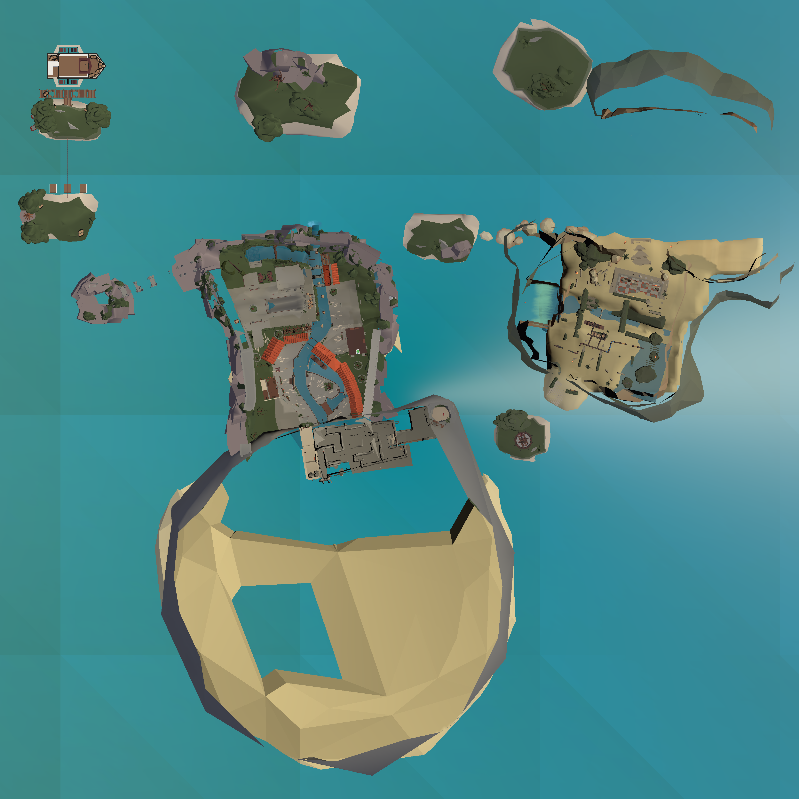
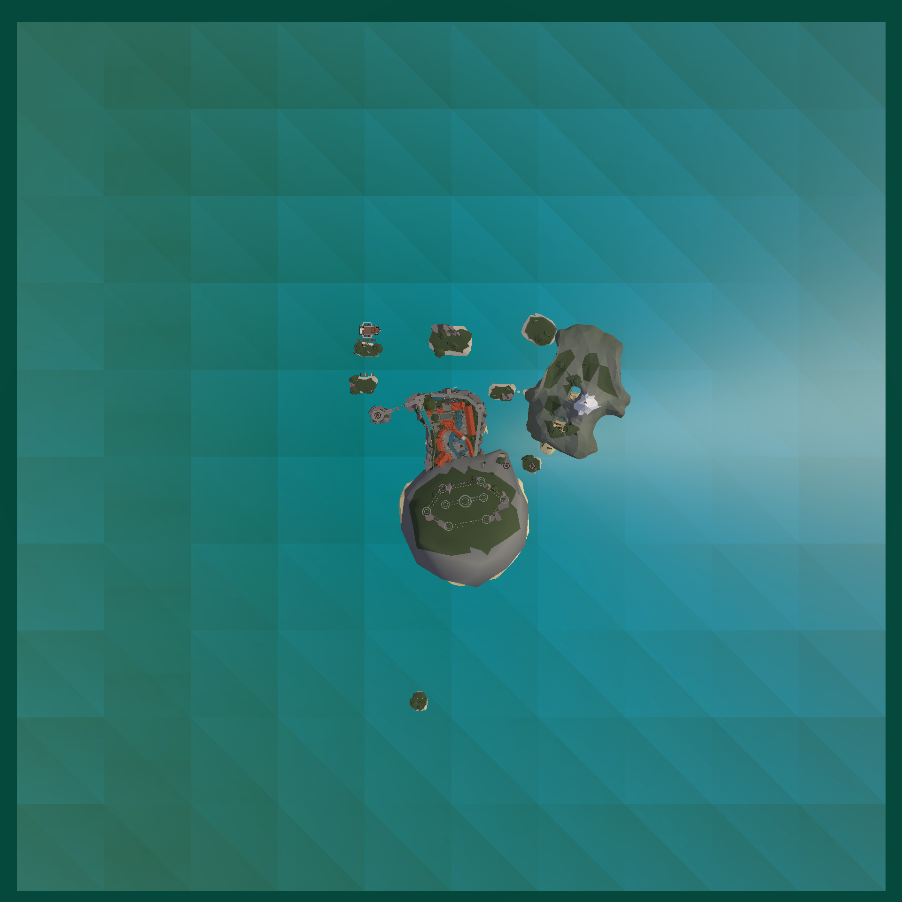

# Editorpick Levels

## + [0.png](0.png)

## - [0-interior.png](0-interior.png)

---

## + [1-a.png](1-a.png)

## - [1-a-interior.png](1-a-interior.png)

## + [1-b.png](1-b.png)

## - [1-b-interior.png](1-b-interior.png)

---

## + [2.png](2.png)

---

## + [3.png](3.png)

## - [3-interior.png](3-interior.png)

---

## + [4.png](4.png)

## - [4-interior.png](4-interior.png)

---

## + [5.png](5.png)

## - [5-bridge.png](5-bridge.png)

## - [5-interior.png](5-interior.png)

---

## + [6.png](6.png)

---

## + [7.png](7.png)

## - [7-interior.png](7-interior.png)

---

## + [8.png](8.png)

## - [8-interior-a.png](8-interior-a.png)

## - [8-interior-b.png](8-interior-b.png)

## - [8-interior-c.png](8-interior-c.png)

---

## + [9.png](9.png)

## - [9-interior-a.png](9-interior-a.png)

## - [9-interior-b.png](9-interior-b.png)

---

## + [10.png](10.png)

## - [10-interior.png](10-interior.png)

---

## + [11.png](11.png)

## - [11-interior.png](11-interior.png)

## - [11-bound.png](11-bound.png)

---

## + [12.png](12.png)

## - [12-surface.png](12-surface.png)

